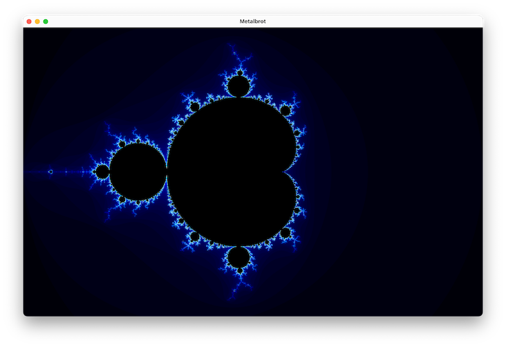

# Metalbrot

The Mandelbrot set for Apple Platforms with Metal Acceleration.

## Status

Multi-platform Metal renderer with pan/zoom interactions and multiple color palettes. macOS and iOS gestures are implemented; tvOS target exists.

## Implemented

* Basic Apple Platforms targets (macOS, iOS/iPadOS, tvOS)
* Unified Multiplatform Xcode Target
* Metal Shaders to draw and color set
* Multiple color palettes
* Viewport Sizing
* Pan and zoom on macOS and iOS

## Known Issues
* Print output does not target the correct view
* Occasional invert/flip artifact during zoom

## In Progress / Next

* Unit tests for view model
* View model enhancements / optimizations 
* View model optimizations and stability at deep zoom
* Reset zoom on macOS and iOS
* Print support
* Settings (e.g., disable Metal HUD)

## Roadmap
* Reset zoom with animation/interpolation
* Shader refactor and shared Metal utilities
* Optional CLI/offscreen renderer for PNG output
